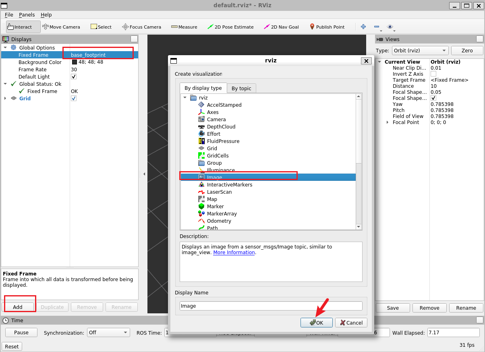
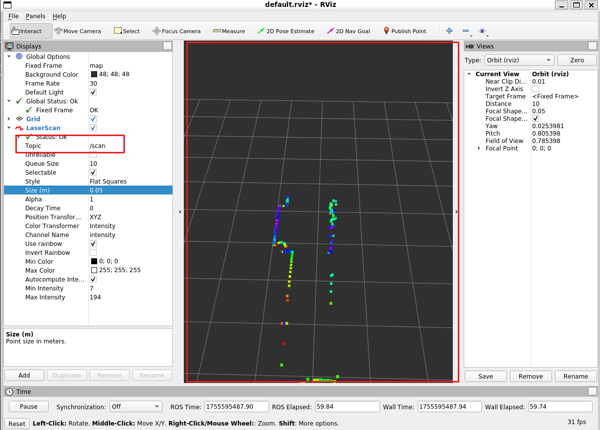
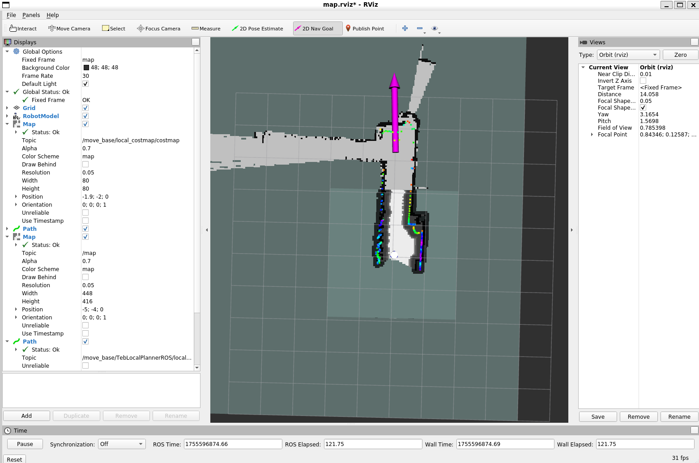
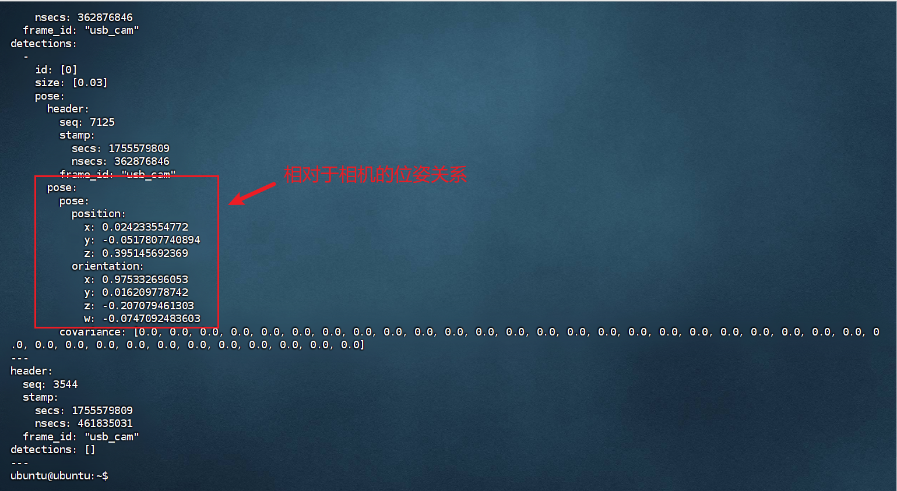
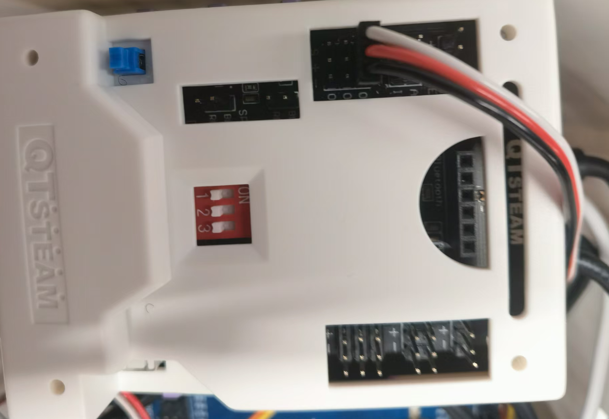

# 到手测试

我们提供两种版本的ROS教育机器人，其ROS主控分别是香橙派3B版本，以及树莓派4B版本，安装的ROS系统版本有差别，分别是noetic（Ubuntu20.04）和melodic（Ubuntu18.04），但是使用方式是一样的。这里以melodic版本的测试过程为例：

到手测试分为以下几个部分：

- SSH连接测试
- 夹爪抓取测试
- 运动底盘测试
- 视频图像测试
- 雷达功能测试

如果到手的时候以上功能出现问题，尽快联系我们的工程师进行返修。

Noetic版本机器人：


Melodic版本机器人：


## SSH连接测试

这是最重要的一个测试，如果无法连接上ROS教育机器人，则后续的测试都无法进行。这里以`Windows`系统下的测试为例：

- 连接机器人发出的WIFI热点

机器人到手默认是发出热点的模式，不能连接上网络，当电脑连接上机器人发出的网络后，它们处于同一个局域网下，此时可以使用SSH连接工具进行连接。

Windows平台下推荐以下SSH连接工具，这里以Finalshell为例：

- [FinalShell](https://finalshells.com/)

- [Xshell](https://www.xshell.com/zh/xshell/)
- [Mobaxterm](https://mobaxterm.mobatek.net/)

### 基础连接

首先连接上WIFI热点，格式为QT-pix，比如这里是QT-pi2，WIFI密码都是==qtsteam@401==


这里右下角没有网络显示是正常现象，不需要担心

使用`ipconfig`查看网络状态


我们配置的ROS主机ip地址都是：192.168.x.1这种形式，这里可以确定ROS主机的ip地址是192.168.3.1，此时打开Finalshell，


neotic版本和melodic版本连接参数不一样，如下所示：

- melodic版本

```
用户名：ubuntu
密码：abc@123
```


- noetic版本

```
用户名：orangepi或者boot
密码：orangepi
```


### ROS多机通信

为了可以在你自己的虚拟机ROS环境（比如VMware、WSL环境）中使用rviz等工具可视化地查看相机、地图等信息，这里需要配置ROS的多机通信。

在此之前，你需要在虚拟机或者WSL环境下安装ROS1（noetic或者melodic两个版本都可以），当然你也可以直接安装双系统。安装上述环境的方法在B站等平台已经有很多教程，这里简要介绍一下安装思路：

#### ROS系统安装

虚拟机里安装Ubuntu的教程已经很多，不再赘述；

[[Windows 和 Ubuntu 双系统的安装和卸载_哔哩哔哩_bilibili](https://www.bilibili.com/video/BV1554y1n7zv/?vd_source=80a76dd04195fcd8e633faef4681dd03)](https://www.bilibili.com/video/BV1554y1n7zv/?vd_source=80a76dd04195fcd8e633faef4681dd03)

[[Windows11 安装 Ubuntu 避坑指南_哔哩哔哩_bilibili](https://www.bilibili.com/video/BV1Cc41127B9/?spm_id_from=333.337.search-card.all.click&vd_source=80a76dd04195fcd8e633faef4681dd03)](https://www.bilibili.com/video/BV1Cc41127B9/?spm_id_from=333.337.search-card.all.click&vd_source=80a76dd04195fcd8e633faef4681dd03)

请注意：Ubuntu20.04对应安装ROS1 noetic版本，Ubuntu18.04对应安装ROS1 melodic版本

在安装好Ubuntu环境之后，就可以使用小鱼的脚本进行ROS环境的安装，直接粘贴以下命令到命令行即可：

```sh
wget http://fishros.com/install -O fishros && . fishros
```

然后进行换系统源->安装ROS->python换源->换rosdep源

完成上述操作后你的电脑上就已经有了ROS的环境了，此时输入`roscore`可以看到输出。

#### 多机通信配置

多机通信分为2步，它需要你在ROS主机上和ROS从机上（你的虚拟机系统）都进行配置

- ROS从机配置

```
sudo apt install vim
sudo apt install net-tools
```

看一下你虚拟机系统的IP地址，这里我以WSL为例，输入`ifconfig`


首先输入以下命令

```sh
sudo vim .bashrc
在打开文件的底下新增语句：
export ROS_MASTER_URI=http://192.168.3.1:11311
export ROS_HOSTNAME=192.168.3.75
```


```
保存时先按Esc，然后Shift+:,输入wq退出
最后输入：
source .bashrc
更新环境变量
输入完后没有出现任何提示则为成功
```

- ROS主机配置

这里你不需要配置，我们出厂已经帮你配置好了，其大体的配置思路和上述一致


- 进行通信测试

首先在ROS主机上输入`roscore`,然后在从机上输入`rostopic list`，效果如下：


以上的测试都没有问题，则进入主要功能的测试


## 夹爪抓取测试

首先使用SSH连接上机器人，然后输入以下launch命令启动节点：

```sh
cd car_ws
source devel/setup.bash
roslaunch robot_bringup bringup.launch
```


然后新建一个SSH窗口，输入以下命令：

```sh
rostopic pub -1 /grab std_msgs/Int32 "data: 1"
rostopic pub -1 /grab std_msgs/Int32 "data: 0"
```


机械臂会进行夹取和松开的动作

==务必注意，在运行指令之前需要先按下机器人上方Arduino控制板的电源键，以及需要确保18650电源的电量充足==


## 运动底盘测试

首先使用SSH连接上机器人，输入以下命令：

```sh
cd car_ws
source devel/setup.bash
roslaunch robot_bringup bringup.launch
```

新建一个SSH连接窗口，输入以下命令：

```sh
cd car_ws
source devel/setup.bash
roslaunch keyboard_control keyboard_teleop.launch 
```


此时根据窗口的提示，使用键盘控制机器人运动，效果如下：


## 视频图像测试

在SSH连接窗口输入以下命令：

```sh
cd car_ws
source devel/setup.bash
roslaunch robot_bringup bringup.launch
```

然后打开你安装了ROS的虚拟机/WSL系统，在终端中输入`rviz`打开RVIZ可视化工具




在图形化界面中按照上图所示选择话题名称，可以看到视频图像会显示在左下角，你也可以使用`rostopic list`查看图像话题，并使用`rostopic echo 话题名称`或者`rostopic info 话题名称`来查看更加详细的信息


## 雷达功能测试

在SSH连接窗口输入以下命令：

```sh
cd car_ws
source devel/setup.bash
roslaunch robot_bringup mapping.launch
```

这里启动了建图节点，在建图节点中会启动雷达节点

然后打开你安装了ROS的虚拟机/WSL系统，在终端中输入`rviz`打开RVIZ可视化工具




按照以上方式选择话题名称，最后可以看到雷达点云的显示


# 核心功能使用

ROS系统中最为常用的功能莫过于建图、导航、视觉功能，接下来将分为3个点介绍ROS这些功能的使用：

- 建图功能
- 导航功能
- 视觉识别功能


## 建图功能

在SSH连接窗口输入以下命令：

```sh
cd car_ws
source devel/setup.bash
roslaunch robot_bringup mapping.launch
```

新建一个SSH连接窗口，输入以下命令：

```sh
cd car_ws
source devel/setup.bash
roslaunch keyboard_control keyboard_teleop.launch 
```

此时可以使用键盘操控机器人进行建图，打开rviz窗口可以显示建图的效果，按照下图添加可视化组件：


在建完图之后可以使用以下命令保存地图，你需要新建一个SSH连接窗口，并输入以下命令：

```sh
cd car_ws
source devel/setup.bash
roslaunch robot_bringup map_saver.launch 
```

保存成功显示如下：


## 导航功能

在导航的时候，你需要把机器人放到建图的起始点，或者使用2D Pose Estimate来初始化姿态


在SSH连接窗口输入以下命令：

```sh
cd car_ws
source devel/setup.bash
roslaunch robot_bringup navigation.launch
```


使用2D Nav Goal 可以进行单点导航




使用Publish Point可以进行多点导航，用法和上面一样，只不过是多设置了几个坐标点


## 视觉识别功能

`apriltag_detection`功能包中集成了识别apriltag码功能，这让机器人有能力通过apriltag码进行定位。

以下链接是对apriltag码的介绍：

[[AprilTag](https://april.eecs.umich.edu/software/apriltag.html)](https://april.eecs.umich.edu/software/apriltag.html)

[[apriltag_ros - ROS Wiki](https://wiki.ros.org/apriltag_ros)](https://wiki.ros.org/apriltag_ros)

简单来说，apriltag码提供了一种方式，可以让机器人借助这个码来获取机器人自身与apriltag码之间的相对位置关系，机器人可以利用这种相对位置关系来进行定位，常用在自动停泊的项目中，比如除草机器人返回充电桩、无人机停泊等等。

我们提供的机器人出厂已经完成了相机标定等工作，现在你只需要准备`tag36h11标签`即可完成对该功能的测试，你可以把标签打印出来，裁剪成规定的大小，然后进行测试。这里使用tag36h11标签族第一个标签进行测试，我打印下来的尺寸是3cm*3cm。


首先新建一个SSH连接窗口，输入以下命令：

```sh
cd car_ws
source devel/setup.bash
roslaunch robot_bringup bringup.launch
```

然后再新建一个SSH连接窗口，输入以下命令：

```sh
cd car_ws
source devel/setup.bash
roslaunch apriltag_detection continuous_detection.launch 
```

打开rviz查看标签与相机之间的坐标关系：


同时，你也可以使用`rostopic list`看到标签的话题，并使用以下命令把日志打印在终端显示：


```
rostopic echo /tag_detections
```



这里重点关注`pose`坐标的含义:

```text
z:tag相对于相机前方的坐标，这里0.395..意思就是tag标签在相机前方0.395..米
x:tag相对于相机水平方向的坐标，这里0.024..指的是tag标签在相机右边0.024..米
y:tag相对于相机竖直方向的坐标，这里-0.05..指的是tag标签在相机上方0.05..米
```


# ROS导航进阶使用

在之前的示例中，导航使用的是TEB局部规划器，为了优化导航的效果，我们在`my_planner`功能包下提供了一个基于纯追踪算法的局部路径规划插件，在动态障碍物较少的情况下使用该导航插件，可以得到更好的导航效果和更精确的定位。

其核心思想是：遍历全局规划器提供的路径采样点，每次选出10个左右的点进行跟随，使用PID算法跟随这些路径点，在到达目标位置之前进行预处理，根据获得的朝向角提前进行定位；避障功能交给代价地图和全局规划器。

使用方式：把之前启动的`navigation.launch`替换成`my_navigation.launch`即可，rviz的使用方式和之前一样

```sh
cd car_ws
source devel/setup.bash
roslaunch robot_bringup my_navigation.launch 
```


对ROS1的全局导航规划器和局部导航规划器进行自定义，可以提高导航的效果，以及避障的灵活性，用户可以自行在github上搜索开源算法，以及B站教程进行自主学习。这里提供局部规划器的自定义步骤：

## plugin框架创建

1. 定义规划器名称
2. 创建ROS功能包
3. 编写规划器的头文件和cpp文件
4. 在CMakeList.txt里添加编译规则
5. 编写插件描述文件
6. 在CMakeList.txt里添加描述文件安装规则
7. package.xml添加插件描述文件地址
8. 编译运行

#### 规划器命名


从TEB以及DWA规划器的使用方式可以看出，规划器类是从基类里面继承而来的，并且在launch文件中把`命名空间/类名`作为参数传入。因此，我们实现自定义局部规划器需要模仿TEB/DWA的实现方式。

这里我们把自定义规划器的名字取为：`MyPlanner`，并放在`my_planner`命名空间下

#### 创建功能包

```text
catkin_create_pkg my_planner roscpp pluginlib nav_core
```

#### 编写主要代码

在/my_planner/include文件夹下新建（如果有下一级my_planner则删掉，比较影响查看）`my_planner.h`：

```cpp
#ifndef MY_PLANNER_H_
#define MY_PLANNER_H_

#include <ros/ros.h>
#include <nav_core/base_local_planner.h>

namespace my_planner 
{
    class MyPlanner : public nav_core::BaseLocalPlanner 
    {
        public:
            MyPlanner();
            ~MyPlanner();

            void initialize(std::string name, tf2_ros::Buffer* tf, costmap_2d::Costmap2DROS* costmap_ros);
            bool setPlan(const std::vector<geometry_msgs::PoseStamped>& plan);
            bool computeVelocityCommands(geometry_msgs::Twist& cmd_vel);
            bool isGoalReached();
    };
} // namespace my_planner
 
#endif // MY_PLANNER_H_
```

其中`MyPlanner` 构造函数一般用来设置节点名称； `initialize`函数一般用来发布订阅话题；`setPlan`用来获取全局规划器的API，主要是获取全局导航路线；`computeVelocityCommands`不断循环来设置跟随全局路线的速度，对局部规划器的自定义操作主要在这个函数中完成；`isGoalReached`用来告诉move_base是否到达目标点。

在/my_planner/src目录新建`my_planner.cpp`：

```cpp
#include "my_planner.h"
#include <pluginlib/class_list_macros.h>
//使用宏的头文件

PLUGINLIB_EXPORT_CLASS( my_planner::MyPlanner, nav_core::BaseLocalPlanner)
//使用PLUGINLIB_EXPORT_CLASS宏把这个类注册成一个插件

namespace my_planner 
{
    MyPlanner::MyPlanner()
    {
        setlocale(LC_ALL,"");
    }
    MyPlanner::~MyPlanner()
    {}

    void MyPlanner::initialize(std::string name, tf2_ros::Buffer* tf, costmap_2d::Costmap2DROS* costmap_ros)
    {
        ROS_WARN("英雄登场");
    }
    bool MyPlanner::setPlan(const std::vector<geometry_msgs::PoseStamped>& plan)
    {
        return true;
    }
    bool MyPlanner::computeVelocityCommands(geometry_msgs::Twist& cmd_vel)
    {
        return true;
    }
    bool MyPlanner::isGoalReached()
    {
        return false;
    }
} // namespace my_planner
```

#### 在`CMakeLists.txt`添加编译规则

```cmake
include_directories(
  include
  ${catkin_INCLUDE_DIRS}
)

add_library(my_planner
  src/my_planner.cpp
)

add_dependencies(my_planner ${${PROJECT_NAME}_EXPORTED_TARGETS} ${catkin_EXPORTED_TARGETS})

target_link_libraries(my_planner
  ${catkin_LIBRARIES}
)
```

#### 新建插件xml描述文件

在/my_planner文件下新建`my_planner_plugin.xml`：

```xml
<library path="lib/libmy_planner">
 <class name="my_planner/MyPlanner" type="my_planner::MyPlanner" base_class_type="nav_core::BaseLocalPlanner">
  <description>
	 自定义规划器
  </description>
 </class>
</library>
```

这里的`lib/libmy_planner`的lib后面的名字，需要与CMakeLists.txt文件里面的`add_library`的名字保持一致，这里的class标签也是要按照固定的格式来写，name和type都是`命名空间+类名`，base_class_type是基类名称。

#### 在`CMakeLists.txt`添加描述文件安装规则

在之前的cmake文件中添加install规则：

```cmake
## Mark other files for installation (e.g. launch and bag files, etc.)
install(FILES
  my_planner_plugin.xml
  DESTINATION ${CATKIN_PACKAGE_SHARE_DESTINATION}
)
```

#### 在`package.xml`添加插件描述文件地址

```xml
<!-- The export tag contains other, unspecified, tags -->
  <export>
    <!-- Other tools can request additional information be placed here -->
    <nav_core plugin="${prefix}/my_planner_plugin.xml"/>
  </export>
```

这里的`${prefix}`代替了功能包地址

#### 编译并测试

```text
需要先确保命名空间和类名在所有文件中都一一对应
catkin_make
source devel/setup.bash
rospack plugins --attrib=plugin nav_core
```


然后修改你导航launch文件中的的局部规划器插件为自定义插件：

```xml
<param name="base_local_planner" value="my_planner/MyPlanner" />
```


# ERCC赛项：基于ROS的搜救任务

在中国教育机器人大赛（ROS搜救机器人赛道中），机器人要求使用ROS的导航框架，导航到四个房间中寻找需要被救援的物体（本文中使用贴有标签的奖杯演示），并把这个物体带会出发点。这个搜救任务使用到了apriltag定位技术，ROS导航技术，这些技术在上文的功能测试中均有提及。

我们针对ERCC的搜救任务，专门编写了一个`rescue_task`功能包作为引导，其中涵盖了ROS多点导航，标签定位等算法的实现。其分为两个案例：标签跟踪案例和完成流程实现。

## 标签跟踪案例

使用以下命令启动节点：

```sh
cd car_ws
source devel/setup.bash
roslaunch rescue_task fine_tuning_test.launch
```

这个节点根据相机位置和标签位置的相对坐标关系，使用了比例控制以及发布cmd_vel速度控制话题，驱动机器人不断靠近贴有标签的目标物体，其配置文件可以在config目录下的`fine_tuning_test_params.yaml`文件中进行修改。

```yaml
# 自动泊车测试节点参数（fine_tuning_test）
# 控制频率
control_rate: 20

# 目标Tag
target_tag_id: 0

# 比例增益
linear_kp: 0.32          # 距离闭环（前进 linear.x）
angular_kp: 1.05         # 横向闭环（转向 angular.z），相机x>0需右转 → w为负

# 速度限制
max_linear_speed: 0.10   # 最大前进速度 (m/s)
min_linear_speed: 0.05   # 最小前进速度（避免过小不动）(m/s)
max_angular_speed: 1.00  # 最大角速度 (rad/s)

# 目标/容差（相机坐标系）
stop_distance_z: 0.138    # 期望停车距离 (m)
# 若希望最终停在图像中心左/右偏一点，可设置 target_x 为正(右)/负(左)
target_x: 0.025            # 横向目标 (m)，默认0对准相机中心
x_tolerance: 0.02        # 横向容差 (m)
z_tolerance: 0.03        # 距离容差 (m)

# 搜索与丢失处理
search_angular_speed: 0.0    # 静止等待，不旋转
lost_timeout_sec: 1.0        # 丢失目标判定超时 (s)

# 误差补偿
x_bias: 0.0                  # 横向测量偏置 (m)，正值向右
z_bias: 0.0                  # 距离测量偏置 (m)，正值向前
linear_feedforward: 0.001      # 线速度前馈 (m/s)，为克服静摩擦可给一个>0的小值
angular_feedforward: 0.001     # 角速度前馈 (rad/s)，为克服静摩擦可给一个>0的小值 
```


## 完整流程实现

使用以下命令启动节点：

```sh
cd car_ws
source devel/setup.bash
roslaunch rescue_task rescue_controller.launch
```

这个节点实现了以下流程：

- 从出发点到第一个房间
- 到达房间进行原地旋转寻找带有标签的目标物体
- 如果寻找到物体则使用标签跟踪算法靠近物体并进行抓取，然后返回出发点；如果没有寻找到物体则继续去下一个房间寻找，直到找到物体或者四个房间都没有找到，最后返回出发点

用户需要做的是：根据导航房间的位置，修改`rescue_controller_params.yaml`配置文件中的导航参数

```yaml
# 救援控制器参数配置文件
# 基本控制参数
control_rate: 20  # Hz

# 机器人起始位置（需要根据实际情况配置）
start_pose:
  position:
    x: 0.0
    y: 0.0
    z: 0.0
  orientation:
    x: 0.0
    y: 0.0
    z: 0.0
    w: 1.0

# 目标搜索点列表（需要根据实际地图配置）
target_poses:
  - position:
      x: 2.055
      y: 0.000
      z: 0.000
    orientation:
      x: 0.000
      y: 0.000
      z: 0.000
      w: 1.000
  - position:
      x: 2.994
      y: 2.587
      z: 0.000
    orientation:
      x: 0.000
      y: 0.000
      z: 1.000
      w: 0.029

# 搜索参数
search_angular_speed: 0.1    # 搜索时的角速度 (rad/s)
search_direction: 1          # 搜索方向: 1=顺时针, -1=逆时针
search_timeout: 30         # 单点搜索超时时间 (秒)

# AprilTag检测参数
target_tag_id: 0             # 目标AprilTag ID
lost_timeout_sec: 1.0        # 目标丢失超时时间 (秒)

# PID控制参数（从fine_tuning_test移植）
linear_kp: 0.32               # 线速度比例增益
angular_kp: 1.05              # 角速度比例增益
max_linear_speed: 0.10        # 最大线速度 (m/s)
min_linear_speed: 0.05       # 最小线速度 (m/s)
max_angular_speed: 1.00       # 最大角速度 (rad/s)

# 接近目标参数
stop_distance_z: 0.138        # 目标停止距离 (m)
x_tolerance: 0.02            # X方向容差 (m)
z_tolerance: 0.03            # Z方向容差 (m)
target_x: 0.025                # 横向对准目标 (m)，0为相机中心

# 误差补偿参数
x_bias: 0.0                  # X测量偏置 (m)
z_bias: 0.0                  # Z测量偏置 (m)
linear_feedforward: 0.001      # 线速度前馈 (m/s)
angular_feedforward: 0.001     # 角速度前馈 (rad/s)

# 抓取相关参数
grab_wait_time: 3.0          # 抓取动作等待时间 (秒)
approach_wait_time: 3.0      # 靠近后等待时间 (秒)

# 最终接近参数
forward_distance: 0.20       # 最终前进距离 (m)
final_approach_speed: 0.1    # 最终接近速度 (m/s)
```

你需要根据rviz发布的坐标点（可以在你虚拟机的终端里面看到），修改上述文件中的`目标搜索点列表`

例如你的第一个导航目标点是：


则你需要把上面的`Position`坐标和`Orientation`坐标填写到对应位置，你需要填写4个坐标，起始位置坐标可以不用改变


# 附录

## 电源模块使用介绍


电源模块里面内置了2块12V锂电池，一个给3个直流减速电机供电，输出的是12V电压；另一个给树莓派/香橙派、STM32主板供电，输出的是5V电压；melodic版本Arduino主板由顶部电池供电，noetic版本Arduino主板由电源模块的5V输出口供电。

2个锂电池满电电压都是12.4V，当电压在9.8V左右的时候，基本上就要没电了，需要及时充电，免得影响调车。

需要使用我们提供的DC接收充电器进行充电，避免烧坏电池。


当电池正在充电的时候，显示红灯


当电池充满电后，显示绿灯


尽量不要在充电的时候打开电压表显示


## 线路连接

### Arduino接线

舵机线接OUT1，白线代表信号S引脚



### STM32接线

#### melodic版本

STM32与直流电机驱动板TB6612的接线表格：

| 轮子编号 | PWM引脚   | 电机引脚1 | 电机引脚2  | 编码器引脚1 | 编码器引脚2 |
| -------- | --------- | --------- | ---------- | ----------- | ----------- |
| MOTOR_A  | PC9->PWMB | PE2->BIN1 | PE3->BIN2  | PD13->E2B   | PD12->E2A   |
| MOTOR_B  | PC8->PWMA | PE4->AIN2 | PE5->AIN1  | PA1->E1B    | PA0->E1A    |
| MOTOR_C  | PC7->PWMB | PE8->BIN1 | PE10->BIN2 | PE9->E2A    | PE11->E2B   |

MOTORA、MOTORB、MOTORC的顺序同如下的noetic版本

接线不当会出现以下2中问题：

- 电机乱转：调换一下编码器或者电机引脚任意一根线即可解决，例如MOTOR_A调转PD13->E2A即可
- 转的方向不对：需要同时调换编码器和电机的引脚，例如MOTOR_A调转PD13->E2A，同时PE2->BIN2


#### noetic版本


STM32与驱动板L298N的接线表格如下：

| 轮子编号 | PWM引脚  | 电机引脚1 | 电机引脚2 | 编码器引脚1 | 编码器引脚2 |
| -------- | -------- | --------- | --------- | ----------- | ----------- |
| MOTOR_A  | PC9->ENA | PE3->IN1  | PE2->IN2  | PD13->C1    | PD12->C2    |
| MOTOR_B  | PC8->ENA | PE4->IN2  | PE5->IN1  | PA1->C1     | PA0->C2     |
| MOTOR_C  | PC7->ENB | PE8->IN4  | PE10->IN3 | PE9->C2     | PE11->C1    |

PH2.0线颜色与直流电机引脚对应关系如下：

M1 -> 红

M2 -> 白

GND-> 黑

VCC->蓝

C1->绿

C2->黄

### 串口接线

分为两个版本：melodic版本和noetic版本，==绝对不能接反==。

- melodic版本


- noetic版本


## 常见问题以及解决方案

- 启动完`bringup.launch`，使用键盘控制机器人运动的时候，只有部分轮子运动，或者轮子全速疯狂转动

很可能是运输的过程中，某些线松了，请你根据上面STM32的接线图表，检查是否有杜邦线松动的现象


- 在上文的夹爪测试中，夹爪一直不动

请你确保Arduino控制板的电源键被按下，同时对于melodic版本的ROS机器人，需要确保2个18650电池有充足的电量


## 软件资料开源地址

[[Jayson-Pan/ERCC_ROS](https://github.com/Jayson-Pan/ERCC_ROS)](https://github.com/Jayson-Pan/ERCC_ROS)


## ROS学习资料推荐

对于刚接触ROS的纯新手，推荐从以下方式入门ROS学习：

### ROS仿真入门

在时间充裕的情况下，推荐赵老师的仿真入门视频，手把手教学：

[[【Autolabor初级教程】ROS机器人入门_哔哩哔哩_bilibili](https://www.bilibili.com/video/BV1Ci4y1L7ZZ/?spm_id_from=333.337.search-card.all.click&vd_source=80a76dd04195fcd8e633faef4681dd03)](https://www.bilibili.com/video/BV1Ci4y1L7ZZ/?spm_id_from=333.337.search-card.all.click&vd_source=80a76dd04195fcd8e633faef4681dd03)

[[Introduction · Autolabor-ROS机器人入门课程《ROS理论与实践》零基础教程](http://www.autolabor.com.cn/book/ROSTutorials/)](http://www.autolabor.com.cn/book/ROSTutorials/)

想速成的看古月的21讲：

[[【古月居】古月·ROS入门21讲 | 一学就会的ROS机器人入门教程_哔哩哔哩_bilibili](https://www.bilibili.com/video/BV1zt411G7Vn/?spm_id_from=333.337.search-card.all.click&vd_source=80a76dd04195fcd8e633faef4681dd03)](https://www.bilibili.com/video/BV1zt411G7Vn/?spm_id_from=333.337.search-card.all.click&vd_source=80a76dd04195fcd8e633faef4681dd03)

追求生动形象的看杰哥：

[[机器人操作系统 ROS 快速入门教程_哔哩哔哩_bilibili](https://www.bilibili.com/video/BV1BP4y1o7pw/?spm_id_from=333.337.search-card.all.click&vd_source=80a76dd04195fcd8e633faef4681dd03)](https://www.bilibili.com/video/BV1BP4y1o7pw/?spm_id_from=333.337.search-card.all.click&vd_source=80a76dd04195fcd8e633faef4681dd03)

基本上看完以上任意一个系列的视频，就可以非常熟练地使用我们提供的ROS功能包进行实车练习了


### ROS书籍推荐

推荐《机器人操作系统ROS应用实践》，该书由各路大佬编写，撰写者包括华中科技大学人工智能与自动化学院副教授，古月创始人，星火机器人创始人。


